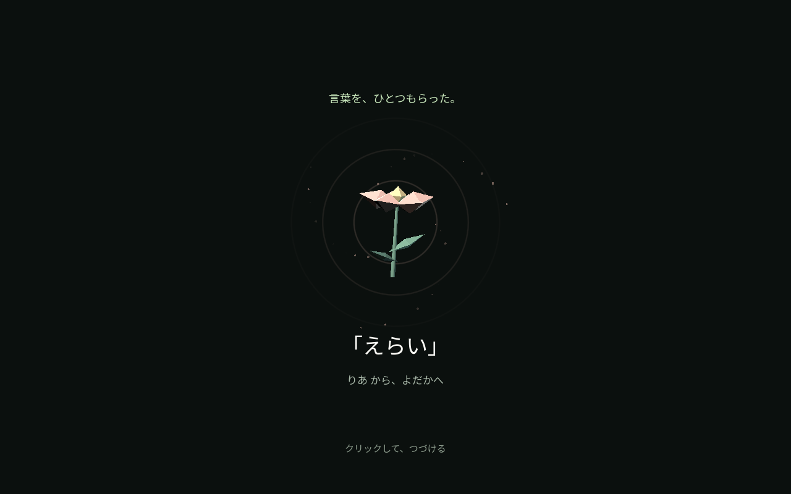
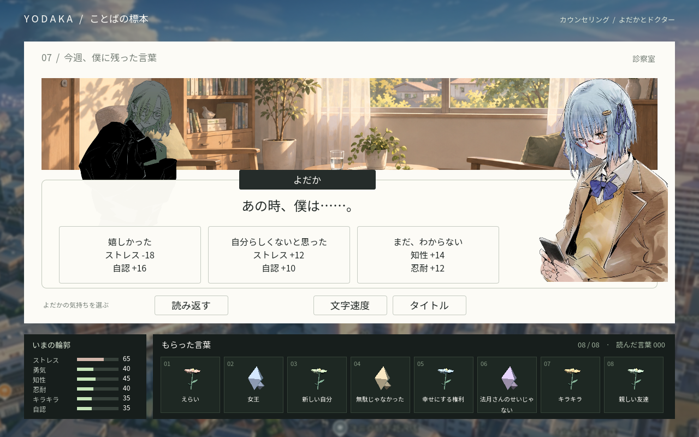
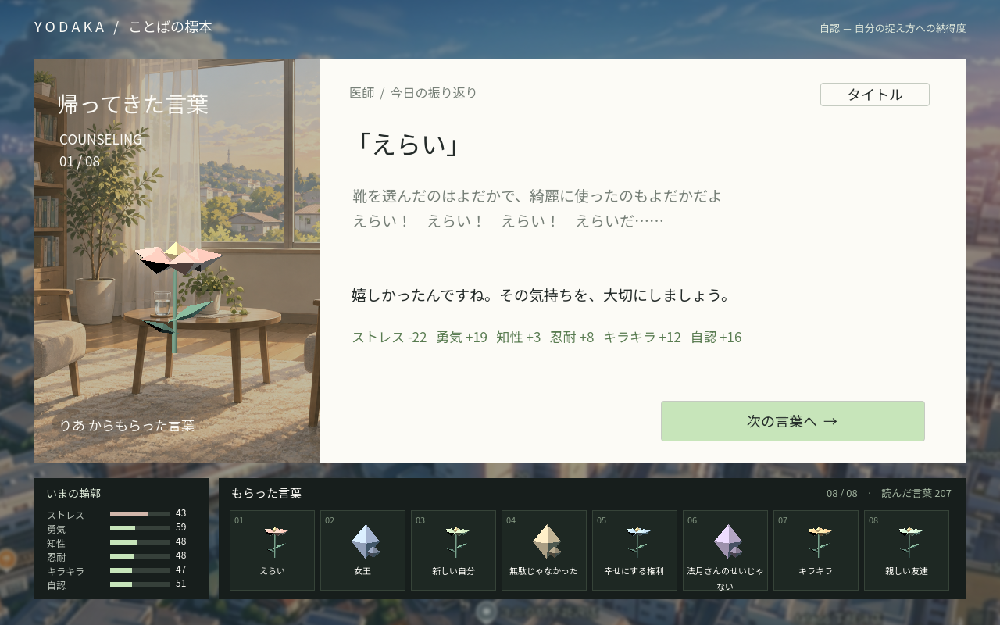
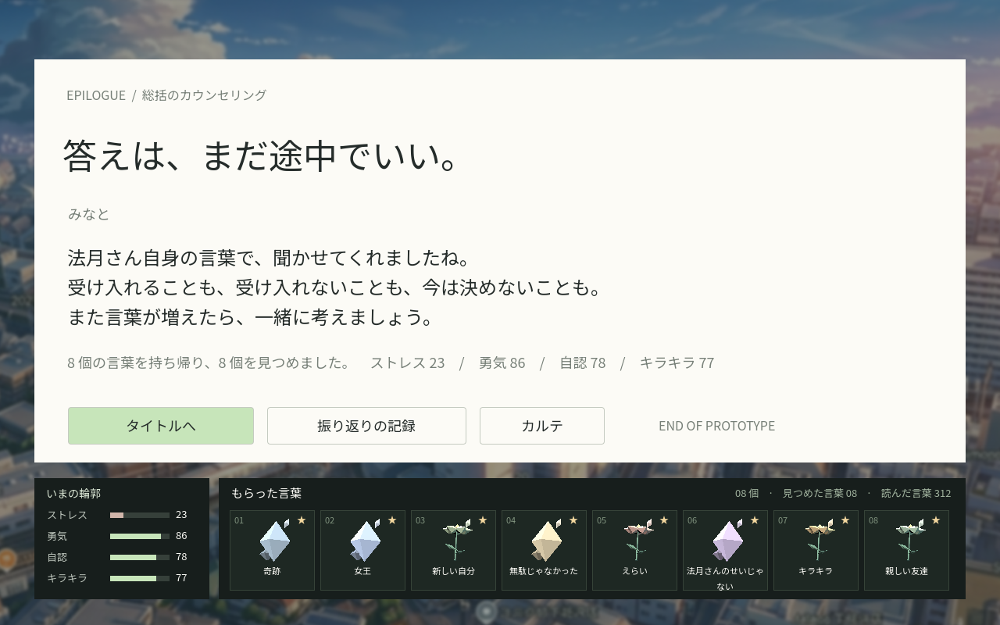

# 検証結果

## 2026-09-09 演出・会話の更新

- `make lint` 成功。`make test` はpytest 2件・カバレッジ98.85%、Godot 1,938チェック成功。
- 24種類の解釈で変動が最大2項目に収まること、予告と適用が一致することを確認。
- 章・場所の暗転、取得演出のクリック必須、AUTO停止、Space/Escapeで飛ばないことを確認。
- 話者の明暗、よだかを右の会話枠の手前へ表示する順序を検証。
- 元の全台詞・追加の回想と返答256件が、中央揃えの本文領域に収まることを検証。
- 旧セーブ形式v1の読み込みと、取得演出・よだかの返答の途中から再開する保存形式v2を検証。
- Chromeで通しプレイし、8個の言葉、8回の回答、エンディング、再読み込みからの再開を確認。
- `tests/browser_smoke.cjs` で実際のIndexedDB保存内容も検証。JavaScript / Godot実行時エラー0件。

## 2026-09-08 初版

2026-09-08、Godot 4.6.2 / macOS / Chrome（Playwrightによる実ブラウザ操作）で確認。

- `make lint`: RuffとGodotの読み込みが成功。
- `make test`: pytest 2件成功。インポーターのカバレッジ98.85%。全12シナリオルートの到達性・分岐排他・8語の到達を確認。
- Godotランタイム検証: 1,583チェック成功。3種の解釈、上下限、保存復元、重複収集防止、二重回答防止、実UIの文字送り・モーダル・終了画面を確認。
- `make web`: 非スレッドのWebリリースビルド成功。
- GitHub Pages公開処理: [実行34229580900](https://github.com/xemonodesign/godot-novel-yodaka/actions/runs/34229580900) 成功。公開URL HTTP 200。
- 公開URLをChromeで読み込み、クリック操作で冒頭からエンディングまで通過。8語の収集と8回答を実際のIndexedDB保存データでも確認。JavaScript / Godotの実行時エラー0件。
- 公開URLを再読み込み →「つづきから」→ 結果画面の復元を確認。
- 標本をクリックして元の発言と解釈を閲覧し、Escapeで閉じられることを確認。
- 1280×800、および844×390の横長画面で画面全体の表示を確認。実機スマートフォン・Safariは未検証。

