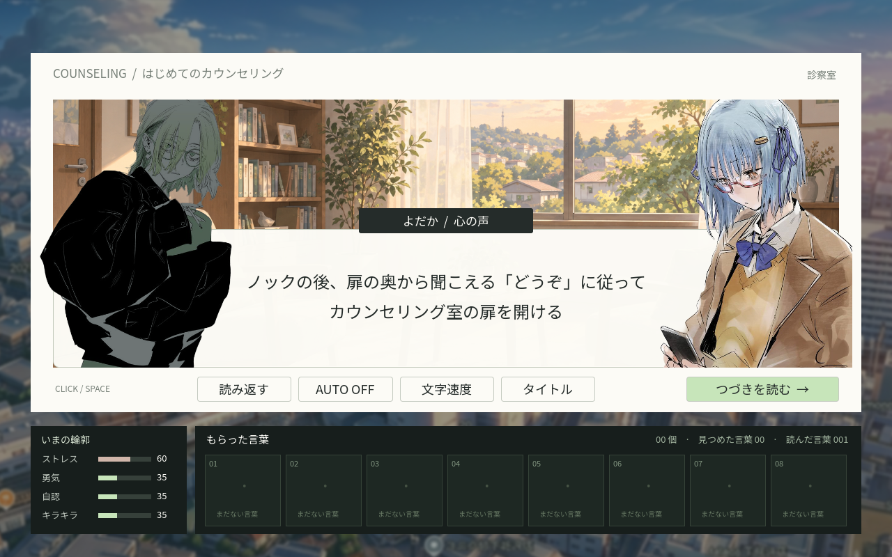
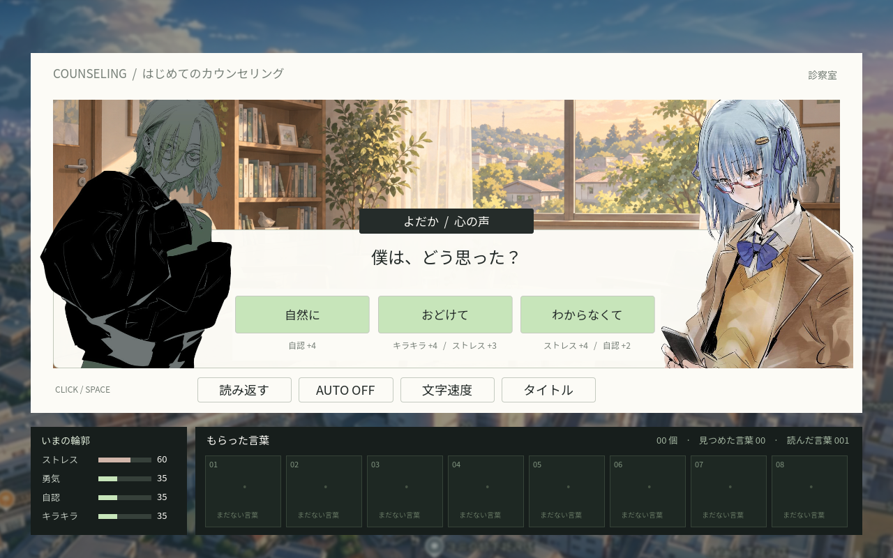
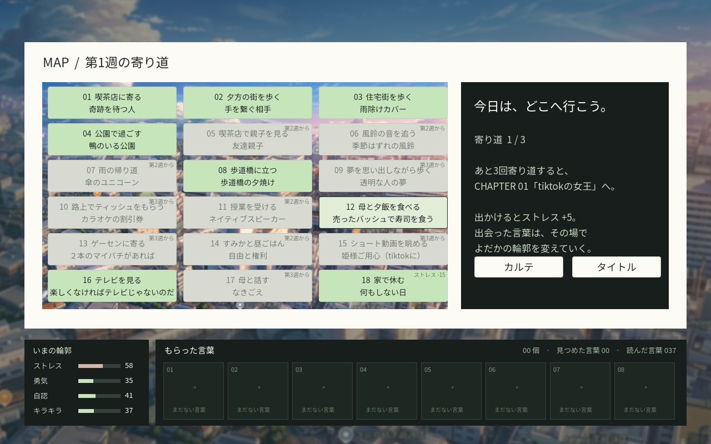
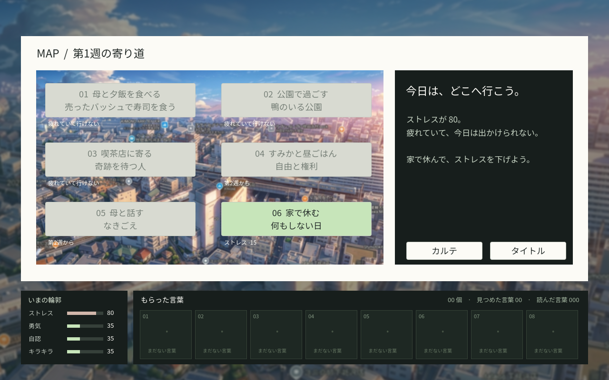
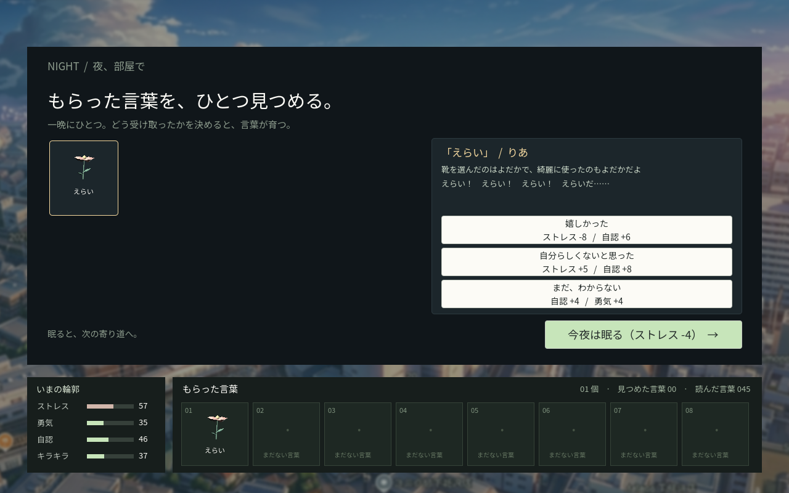
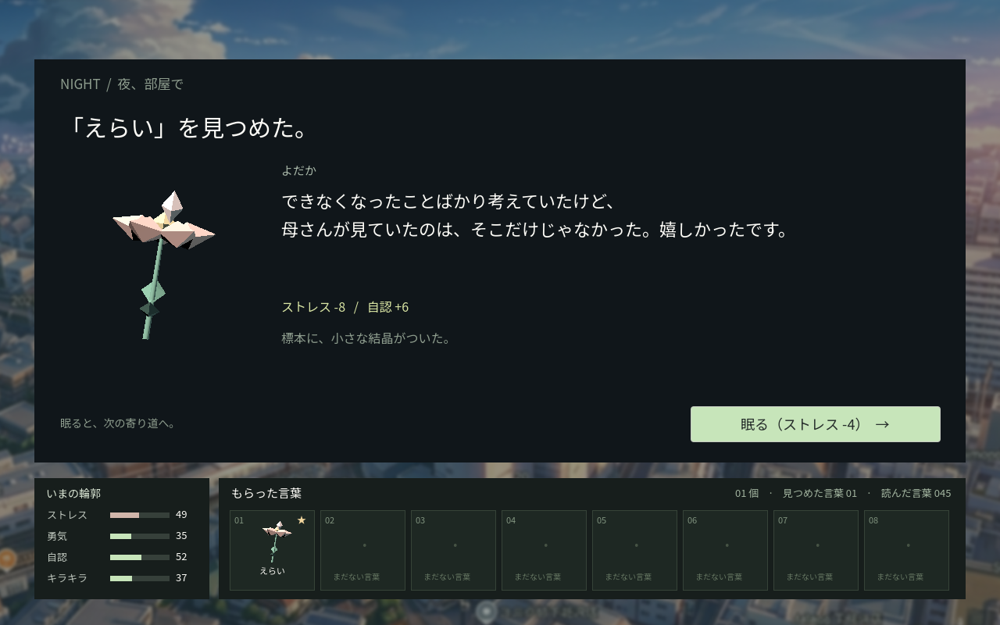
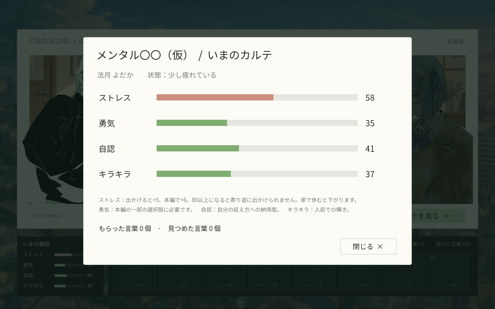
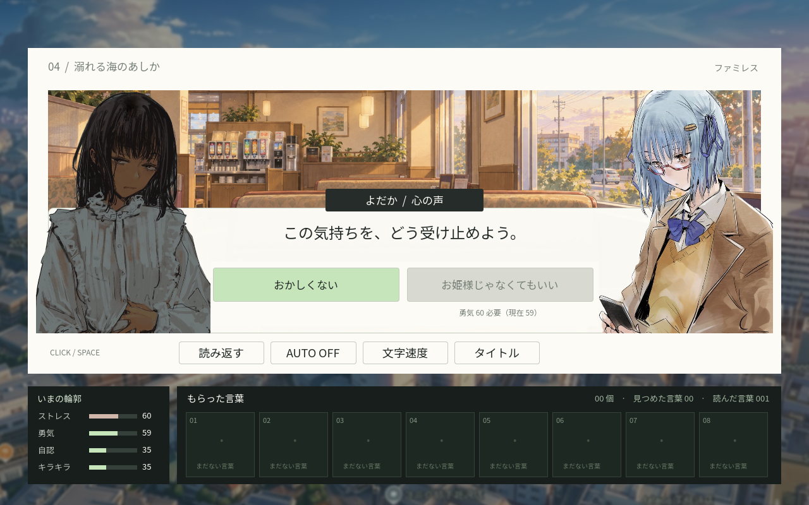

# 検証結果

## 2026-09-25 プロトの流れの変更（カウンセリング → 寄り道 → 夜 → 本編 → 総括）

- `make lint` 成功（Ruff、Godot 4.6.2の読み込み）。`make test` はpytest 4件・カバレッジ98.31%、Godot 3,581チェック成功。
- 冒頭カウンセリングの3択×3＝27通りがすべてMAPに到達。台本の「選択肢」「〜を選択」「選択肢差分終了」から分岐を構築し、各選択の効果が4指標の範囲内であることを確認。
- 本編4章（1・3・2・2ルート）と寄り道6種がすべて夜に到達し、全289ノードが到達可能。寄り道ごとの取得語（寿司：えらい、喫茶店：奇跡、すみか：幸せにする権利、母と話す：かわいい、公園・休息：なし）を確認。
- 3方針の通しプレイで、寄り道6回・本編4章の順序、毎晩1語だけ育つこと、育てた言葉は総括で聞かれないこと、未成長の言葉だけ総括で選ぶことを検証。
- 言葉の取得・チュートリアルの選択・休息で、その場でパラメータが動き、差分が記録されることを確認。予告と適用の一致、1回最大2項目、0〜100の範囲を検証。
- 週による行き先の解放、訪問済みの無効化、ストレス80以上での外出制限と休息の許可、勇気59で拒否・60で「お姫様じゃなくてもいい」へ進行を確認。
- 保存形式v4の復元、旧形式（v3）と壊れた保存の拒否、夜・総括の途中からの再開を検証。
- 実UIで4本のバー、みなとの立ち絵、チュートリアル選択の効果予告、カルテの表示と閉じるまで進まないこと、取得暗転での増減表示、MAPの有効ボタン数（3か所＋休息）、夜の成長予告と1晩1語の制限、総括の順序（回想→育てた返答→受け止め／問い→選択→返答→受け止め→カルテ→結び）を確認。
- 台本・回想・返答・総括の全文が本文領域に収まることを検証。
- Chromium（Playwright、`build/web` をローカル配信）で通しプレイを完走：寄り道6回・夜10回・夜に育てた言葉8語・取得10語、本編4章、カルテ2回、総括で残りの言葉を回答して結果画面へ。再読み込み後の「つづきから」で結果画面を復元。最終ステータス [0, 82, 76, 85]。
- 同じブラウザでIndexedDBの実データを差し替え、取得暗転のクリック必須と増減表示、チュートリアル選択の効果（自然に → 自認+4）、ストレス80での外出制限と休息の選択、勇気59/60の分岐制御、総括の回答と返答の保存を確認。JavaScript / Godot実行時エラー0件。
- 844×390の横長画面で全体表示を確認。実機スマートフォン・Safariは未検証。GitHub Pages [公開処理36175062531](https://github.com/xemonodesign/godot-novel-yodaka/actions/runs/36175062531) 成功（gh-pages 01263dc、この検証と同じビルド）。公開URLはこの作業環境から到達できないため、配信物の一致は未確認。

## 2026-09-10 MAP・勇気分岐・背景の更新

- `make lint` 成功。`make test` はpytest 2件・カバレッジ98.97%、Godot 2,722チェック成功。
- MAPの3イベントを含む全36ルートが中間カウンセリングを経てCHAPTER 6に進み、最後のカウンセリングまで到達。
- 1周の収集数は公園8語、母・喫茶店9語。イベントの二重選択、言葉の重複収集・再回答を防止。
- 勇気54で選択を拒否、55で「お姫様じゃなくてもいい」へ進行。UIの無効化も確認。
- カウンセリングによる勇気の上昇、中間・最後それぞれの帰り先、保存復元を検証。
- 左右の立ち絵のサイズ・縦位置・会話枠より手前の描画順、本文の画面中央配置、母・すみかの表示を検証。
- 台本・回想・返答の全文が本文領域に収まることを検証。
- ChromeでMAP経由の通しプレイ・8語8回答・結果・再開を確認。母・すみか・喫茶店の描画、勇気54/55の選択制御、返信の保存復元も実際のIndexedDBで確認。実行時エラー0件。
- 素材の透明余白を除き、全身素材を上半身に収める表示処理で立ち絵の見た目の高さを統一。

- 公開URLで同じChrome検証を完走。MAP選択・8語8回答・エンディング・勇気54/55の制御・返信からの再開に成功。実行時エラー0件。
- GitHub Pages [公開処理34457593226](https://github.com/xemonodesign/godot-novel-yodaka/actions/runs/34457593226) 成功。配信中のPCK（26,293,828 bytes）がローカルリリースとSHA-256で一致。

## 2026-09-09 演出・会話の更新

- `make lint` 成功。`make test` はpytest 2件・カバレッジ98.85%、Godot 1,938チェック成功。
- 24種類の解釈で変動が最大2項目に収まること、予告と適用が一致することを確認。
- 章・場所の暗転、取得演出のクリック必須、AUTO停止、Space/Escapeで飛ばないことを確認。
- 話者の明暗、よだかを右の会話枠の手前へ表示する順序を検証。
- 元の全台詞・追加の回想と返答256件が、中央揃えの本文領域に収まることを検証。
- 旧セーブ形式v1の読み込みと、取得演出・よだかの返答の途中から再開する保存形式v2を検証。
- Chromeで通しプレイし、8個の言葉、8回の回答、エンディング、再読み込みからの再開を確認。
- `tests/browser_smoke.cjs` で実際のIndexedDB保存内容も検証。JavaScript / Godot実行時エラー0件。

## 2026-09-08 初版

2026-09-08、Godot 4.6.2 / macOS / Chrome（Playwrightによる実ブラウザ操作）で確認。

- `make lint`: RuffとGodotの読み込みが成功。
- `make test`: pytest 2件成功。インポーターのカバレッジ98.85%。全12シナリオルートの到達性・分岐排他・8語の到達を確認。
- Godotランタイム検証: 1,583チェック成功。3種の解釈、上下限、保存復元、重複収集防止、二重回答防止、実UIの文字送り・モーダル・終了画面を確認。
- `make web`: 非スレッドのWebリリースビルド成功。
- GitHub Pages公開処理: [実行34229580900](https://github.com/xemonodesign/godot-novel-yodaka/actions/runs/34229580900) 成功。公開URL HTTP 200。
- 公開URLをChromeで読み込み、クリック操作で冒頭からエンディングまで通過。8語の収集と8回答を実際のIndexedDB保存データでも確認。JavaScript / Godotの実行時エラー0件。
- 公開URLを再読み込み →「つづきから」→ 結果画面の復元を確認。
- 標本をクリックして元の発言と解釈を閲覧し、Escapeで閉じられることを確認。
- 1280×800、および844×390の横長画面で画面全体の表示を確認。実機スマートフォン・Safariは未検証。

